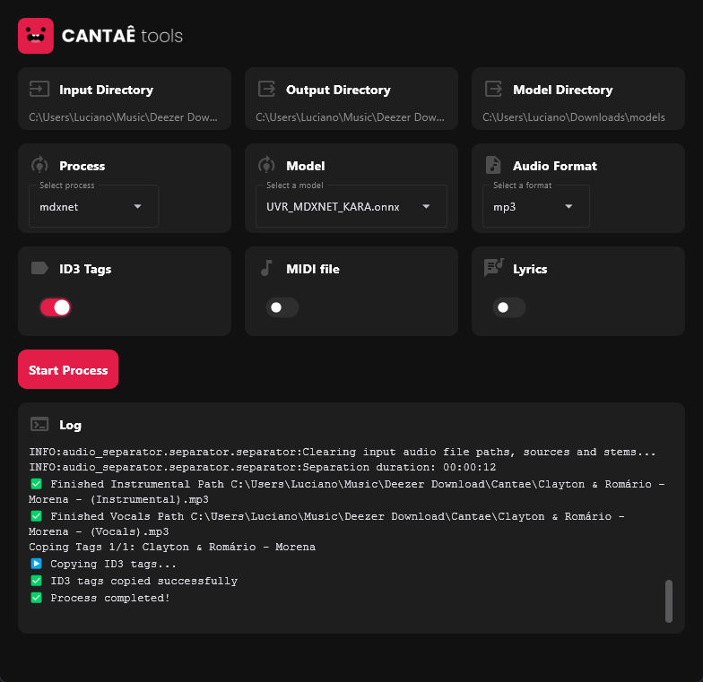

<p align="center">
    
</p>

# Cantaê AI Tools

Easily separate vocals and instruments, copy tags, generate MIDI files, and generate lyrics.

<p align="center">
    
</p>

## Features
- Separate audio into two stems: instrumental and vocals.
- Supports all common audio formats (WAV, MP3, FLAC, M4A, etc.).
- Copy ID3 tags to stems.
- Generate MIDI files from vocals used in the score.
- Generate lyrics.

## Commands
```
# Run dev
flet run main.py -d

# Build app
flet build windows -v
```

You may need to reinstall both packages directly, allowing pip to calculate the right versions for your platform, for example:

- `pip uninstall torch onnxruntime`
- `pip cache purge`
- `pip install --force-reinstall torch torchvision torchaudio`
- `pip install --force-reinstall onnxruntime-gpu`

I generally recommend installing the latest version of PyTorch for your environment using the command recommended by the wizard here:
<https://pytorch.org/get-started/locally/>